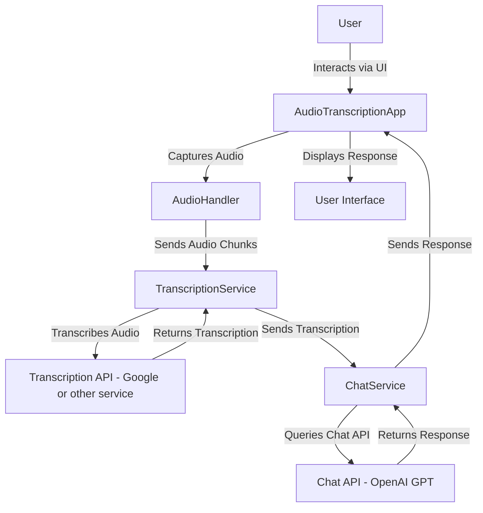

# SpeechFlow

SpeechFlow is a modular and extensible application for real-time audio transcription and intelligent conversational responses. It leverages transcription services and conversational AI models provided by the `thinkhub` library to provide a seamless experience for speech processing and natural language understanding.

## Features

- **Real-Time Audio Capture**: Record and process audio in real-time.
- **Out-of-the-Box Transcription Services**:
  - **OpenAI**: Using the `whisper-1` model.
  - **Google Speech-to-Text**
- **Out-of-the-Box Chat Services**:
  - **OpenAI**: Supporting models like `gpt-4` and `gpt-3.5`.
  - **Anthropic**: Supporting `Claude.ai`.
- **Extensible Design**: Use the Strategy Pattern to easily add new transcription and chat services.
- **Configuration-Driven**: Control services and settings dynamically using `.env` files.
- **Interactive UI**: Built with [Textual](https://textual.textualize.io/) for a rich terminal-based user interface.

### **Image Processing**
- **OpenAI**: Analyze and process images with AI models (not used in this project).

Learn more about the `thinkhub` library at [https://github.com/mfenerich/thinkhub](https://github.com/mfenerich/thinkhub).

---

## Installation

### Prerequisites
- Python 3.11+
- [Poetry](https://python-poetry.org/)

### Clone the Repository
```bash
git clone https://github.com/mfenerich/SpeechFlow.git
cd speechflow
```

### Install Dependencies
Use Poetry to install project dependencies:
```bash
poetry install
```

### Set Up Environment Variables
Create a `.env` file in the root directory with the following content:

```env
# Transcription service
TRANSCRIPTION_SERVICE=openai or google

# Chat service
CHAT_SERVICE=openai or anthropic

# OpenAI settings
CHATGPT_API_KEY=your_openai_api_key
CHAT_MODEL=gpt-4o or claude-3-5-sonnet-20240620 (or any other model you have access to)

# Google
GOOGLE_APPLICATION_CREDENTIALS=your_gcp_json_path
```

Provide appropriate values for each variable.

### Verify Environment
Make sure the `.env` file is listed in `.gitignore` to avoid accidentally committing sensitive data.

---

## Usage

### Run the Application
Start the SpeechFlow application:
```bash
poetry run python app.py
```

### Interact with the Application
- Select an audio input device.
- Press **`K`** to start recording and **`K`** again to stop.
- Press **`Q`** to quit the application.

### Change Transcription or Chat Services
To use a different transcription or chat service, update the `TRANSCRIPTION_SERVICE` and `CHAT_SERVICE` variables in the `.env` file. Restart the application to apply the changes.

---

## Project Structure

```plaintext
speechflow/
├── core/                              # Core utilities and constants
│   ├── constants.py                   # Shared constants (e.g., sample rate)
│   ├── audio_handler.py               # Audio capture and processing
│   └── interface.py                   # UI components
├── app.py                             # Main application entry point
├── .env                               # Environment variables (ignored by Git)
├── .env.example                       # Example environment variables
├── README.md                          # Project documentation
├── poetry.lock                        # Poetry lock file
├── pyproject.toml                     # Poetry project configuration
└── tests/                             # Unit tests
```

---

## Extending SpeechFlow

SpeechFlow is designed to be modular and extensible. You can easily add new transcription or chat services by utilizing the `thinkhub` library.

Learn more about extending services in the [thinkhub repository](https://github.com/mfenerich/thinkhub).

---

## Testing

TODO

---

## Workflow Diagram



---

## Contributing

Contributions are welcome! Please follow these steps:
1. Fork the repository.
2. Create a new branch: `git checkout -b feature-name`.
3. Commit your changes: `git commit -m "Add feature-name"`.
4. Push to the branch: `git push origin feature-name`.
5. Open a pull request.

---

## License

This project is licensed under the MIT License. See the [LICENSE](LICENSE) file for details.

---

## Acknowledgments
- [Textual](https://textual.textualize.io/) for the interactive UI framework.
- [thinkhub](https://github.com/mfenerich/thinkhub) for providing transcription and chat services.
- [Google Cloud Speech-to-Text](https://cloud.google.com/speech-to-text) for transcription services.
- [OpenAI](https://openai.com/) for conversational AI.

---

## Contact
For questions or support, please contact `marcel@feneri.ch` or open an issue in the repository.
