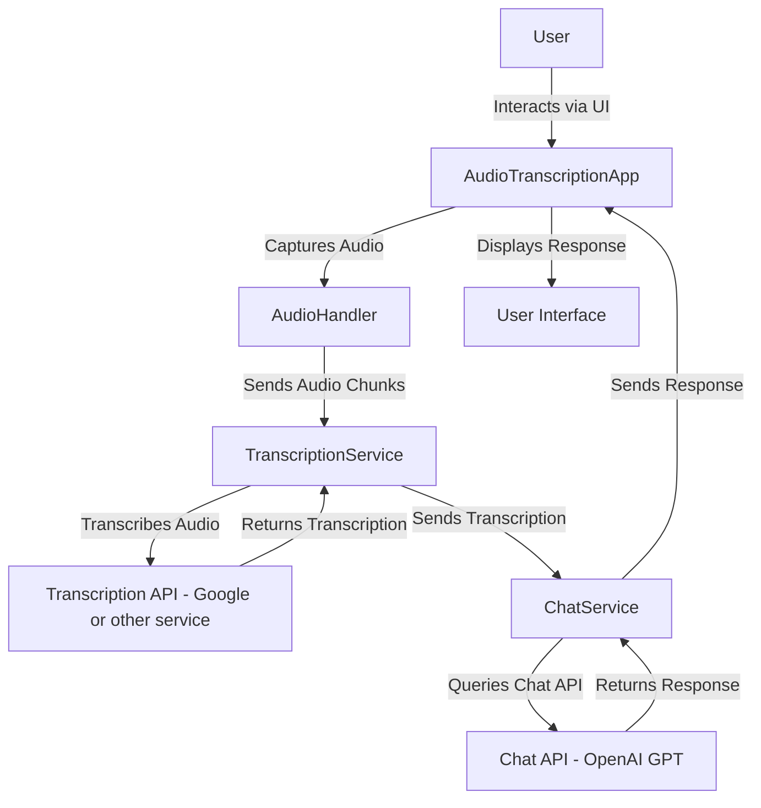

# SpeechFlow

SpeechFlow is a modular and extensible application for real-time audio transcription and intelligent conversational responses. It leverages transcription services like Google Speech-to-Text and conversational AI models like OpenAI's ChatGPT to provide a seamless experience for speech processing and natural language understanding.

## Features

- **Real-Time Audio Capture**: Record and process audio in real-time.
- **Pluggable Transcription Services**: Dynamically switch between transcription providers (e.g., Google Speech-to-Text, Azure, AWS) via configuration.
- **Intelligent Conversational AI**: Integrates with OpenAI's ChatGPT for generating context-aware responses.
- **Extensible Design**: Use the Strategy Pattern to easily add new transcription and chat services.
- **Configuration-Driven**: Control services and settings dynamically using `.env` files.
- **Interactive UI**: Built with [Textual](https://textual.textualize.io/) for a rich terminal-based user interface.

---

## Installation

### Prerequisites
- Python 3.11+
- [Poetry](https://python-poetry.org/)

### Clone the Repository
```bash
git clone https://github.com/mfenerich/SpeechFlow.git
cd speechflow
```

### Install Dependencies
Use Poetry to install project dependencies:
```bash
poetry install
```

### Set Up Environment Variables
Create a `.env` file in the root directory with the following content:

```env
# Transcription service
TRANSCRIPTION_SERVICE=speechflow.services.transcription.google_transcription.GoogleTranscriptionService

# Chat service
CHAT_SERVICE=speechflow.services.chat.openai_chat.OpenAIChatService

# OpenAI settings
CHATGPT_API_KEY=your_openai_api_key
CHATGPT_MODEL=gpt-4o

# Google
GOOGLE_APPLICATION_CREDENTIALS=your_gcp_json_path
```

Provide appropriate values for each variable.

### Verify Environment
Make sure the `.env` file is listed in `.gitignore` to avoid accidentally committing sensitive data.

---

## Usage

### Run the Application
Start the SpeechFlow application:
```bash
poetry run python app.py
```

### Interact with the Application
- Select an audio input device.
- Press **`K`** to start recording and **`K`** again to stop.
- Press **`Q`** to quit the application.

### Change Transcription or Chat Services
To use a different transcription or chat service, update the `TRANSCRIPTION_SERVICE` and `CHAT_SERVICE` variables in the `.env` file. Restart the application to apply the changes.

---

## Project Structure

```plaintext
speechflow/
├── services/                          # All service implementations
│   ├── transcription/                 # Transcription services
│   │   ├── base.py                    # Abstract base class for transcription services
│   │   ├── google_transcription.py    # Google implementation
│   ├── chat/                          # Chat services
│   │   ├── base.py                    # Abstract base class for chat services
│   │   └── openai_chat.py             # OpenAI implementation
├── core/                              # Core utilities and constants
│   ├── constants.py                   # Shared constants (e.g., sample rate)
│   ├── audio_handler.py               # Audio capture and processing
│   └── interface.py                   # UI components
├── app.py                             # Main application entry point
├── .env                               # Environment variables (ignored by Git)
├── .env.example                       # Example environment variables
├── README.md                          # Project documentation
├── poetry.lock                        # Poetry lock file
├── pyproject.toml                     # Poetry project configuration
└── tests/                             # Unit tests
```

---

## Extending SpeechFlow

SpeechFlow is designed to be modular and extensible. You can easily add new transcription or chat services by following these steps:

### Add a New Transcription Service
1. Create a new file under `speechflow/services/transcription/`.
2. Implement the `TranscriptionServiceInterface` from `base.py`.
3. Register the new service in your `.env` file.

Example:
```python
# my_new_transcription.py
from speechflow.services.transcription.base import TranscriptionServiceInterface

class MyNewTranscriptionService(TranscriptionServiceInterface):
    async def initialize_client(self):
        pass  # Initialization logic

    async def transcribe(self, file_path: str) -> str:
        pass  # Transcription logic

    async def close(self):
        pass  # Cleanup logic
```

### Add a New Chat Service
1. Create a new file under `speechflow/services/chat/`.
2. Implement the `ChatServiceInterface` from `base.py`.
3. Register the new service in your `.env` file.

Example:
```python
# my_new_chat_service.py
from speechflow.services.chat.base import ChatServiceInterface

class MyNewChatService(ChatServiceInterface):
    async def stream_chat_response(self, transcription: str, system_prompt: str):
        pass  # Chat response logic
```

---

## Testing

TODO

---

## Workflow Diagram



---

## Contributing

Contributions are welcome! Please follow these steps:
1. Fork the repository.
2. Create a new branch: `git checkout -b feature-name`.
3. Commit your changes: `git commit -m "Add feature-name"`.
4. Push to the branch: `git push origin feature-name`.
5. Open a pull request.

---

## License

This project is licensed under the MIT License. See the [LICENSE](LICENSE) file for details.

---

## Acknowledgments
- [Textual](https://textual.textualize.io/) for the interactive UI framework.
- [Google Cloud Speech-to-Text](https://cloud.google.com/speech-to-text) for transcription services.
- [OpenAI](https://openai.com/) for conversational AI.

---

## Contact
For questions or support, please contact `marcel@feneri.ch` or open an issue in the repository.
